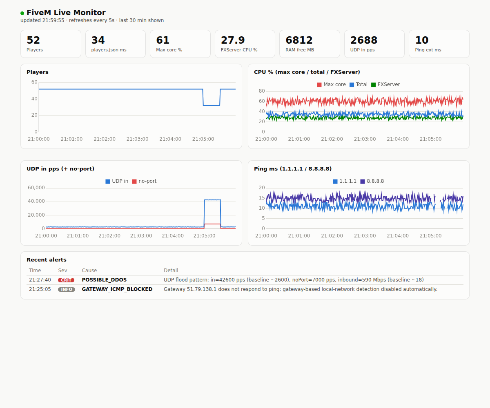
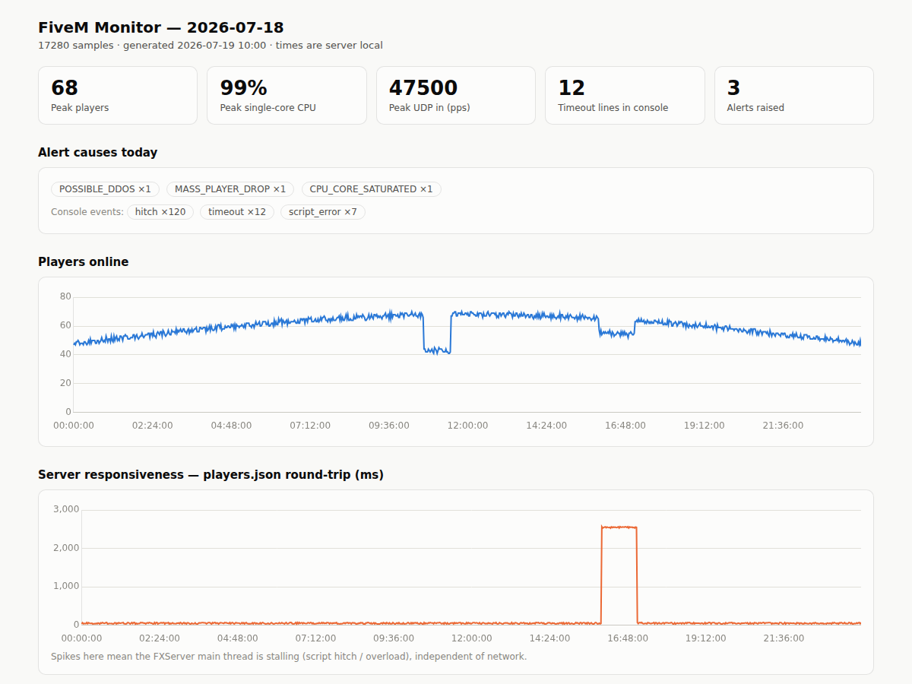

# fivem-sentinel

Diagnostics for FiveM servers that answers one question: **when players time out, what actually caused it?**

Anyone who has run a busy FiveM server knows the drill. Half the city times out at once, Discord blows up, and you're left guessing: was it a DDoS? The host's network? A script hitching the main thread? RAM? By the time you open Task Manager, whatever it was is over.

fivem-sentinel runs quietly in the background (Windows and Linux), samples the signals that separate those causes every few seconds, and when a mass disconnect happens it writes one line telling you which conditions were abnormal at that exact moment. It also gives you a live web dashboard and a daily HTML report with charts.

Typical footprint is under 1% of one core and a few dozen MB of RAM. No packet capture, no dependencies beyond what ships with the OS.



## How it decides

Every 5 seconds the monitor records:

- player count and response time of the server's own `players.json` endpoint (a slow or dead response means the main thread is stalling, regardless of network)
- total CPU and the **busiest single core** — FiveM's main/sync threads are single-core bound, so one pegged core causes timeouts while Task Manager shows plenty of idle CPU
- FXServer's own CPU, RAM, thread count and PID (a PID change means a crash/restart)
- available RAM and hard page faults
- UDP packets/sec in/out, and datagrams hitting **closed ports** — a classic flood signature
- NIC bandwidth, with a slow-moving baseline so a spike is measured against *your* normal traffic
- ping to the default gateway and to two independent external targets (1.1.1.1 and 8.8.8.8)

It also tails the FXServer/txAdmin console log for hitch warnings, `SCRIPT ERROR` lines (with the resource name), and timeout messages.

When several players drop in one interval, it correlates everything and writes a `MASS_PLAYER_DROP` alert naming the suspects:

| Alert cause | Meaning | What to do |
|---|---|---|
| `POSSIBLE_DDOS` | Inbound pps and bandwidth far above your baseline, and/or packets flooding closed ports | Check your host's DDoS console for the same timestamp |
| `LOCAL_NETWORK_LOSS` | Losing pings to your own gateway — machine/host network, not the internet | NIC drivers, virtual switch, host node; ticket your provider |
| `UPSTREAM_NETWORK` | Loss/latency to **both** external targets at once (one bad anycast node never triggers this) | Provider upstream/ISP route; ticket with traceroute |
| `CPU_CORE_SATURATED` | One core pinned near 100% | Find the heavy resource (txAdmin, `profiler record`), or better single-core hardware |
| `RAM_PRESSURE` | Low available RAM or heavy paging | Fix leaking scripts, add RAM |
| `SCRIPT_HITCH` | Hitch warnings without CPU saturation — something is blocking the tick | Check the events CSV for the offending resource |
| `SERVER_THREAD_SLOW` / `SERVER_UNRESPONSIVE` | The server's own HTTP endpoint is slow/dead while the process lives | Almost always a script or DB stall |
| `SERVER_RESTARTED` / `SERVER_DOWN` | FXServer PID changed or vanished | Check crash logs at that timestamp |
| `MASS_PLAYER_DROP … Suspected: UNKNOWN` | Players dropped but nothing on the box was abnormal | Strong evidence the problem is outside the machine (edge filtering, player-side routes) — take the timestamp to your host |

Gateways that never answer ICMP (common on OVH and other datacenter networks) are detected automatically and excluded instead of raising false alarms.

## Install — Windows (txAdmin or standalone)

Requires Windows Server 2016+ / PowerShell 5.1+. Copy the repo onto the server, then from an elevated PowerShell in `windows\`:

```powershell
# test it in the foreground first — it should find your FXServer, gateway and console log
powershell -ExecutionPolicy Bypass -File .\FiveM-Monitor.ps1

# install as a boot-time background task (runs as SYSTEM, below-normal priority)
powershell -ExecutionPolicy Bypass -File .\Install-Monitor.ps1
```

The live dashboard is at `http://localhost:8123` while the monitor runs. Build the daily report with:

```powershell
powershell -ExecutionPolicy Bypass -File .\New-MonitorReport.ps1 -Open
```

Uninstall with `.\Install-Monitor.ps1 -Uninstall`.

## Install — Linux (systemd)

Requires bash 4+, `curl`, `iproute2`; `jq` and `python3` recommended (dashboard and reports need python3). Run the monitor as the same user as your FiveM server:

```bash
cd linux
./fivem-monitor.sh                 # foreground test, Ctrl+C to stop
sudo ./install.sh --user fivem     # install systemd services and start them
```

That installs `fivem-sentinel.service` (the monitor) and `fivem-sentinel-dash.service` (dashboard on `http://localhost:8123`; skip with `--no-dashboard`). Configuration is via environment variables — for a permanent change add e.g. `Environment=SERVER_PORT=30125` to the unit file, or edit the defaults at the top of `fivem-monitor.sh`.

Daily report:

```bash
python3 tools/generate-report.py            # today
python3 tools/generate-report.py --date 2026-07-18
```



## Configuration

Windows: parameters on `FiveM-Monitor.ps1`, forwarded through the installer with `-MonitorArgs`. Linux: environment variables with the same meanings.

| Windows | Linux | Default | Purpose |
|---|---|---|---|
| `-IntervalSec` | `INTERVAL` | `5` | seconds between samples |
| `-ServerPort` | `SERVER_PORT` | `30120` | game port; also used to find the right FXServer process under txAdmin |
| `-ConsoleLogPath` | `CONSOLE_LOG` | auto | path to `fxserver.log` (auto-detected from common txData locations) |
| `-ExternalPingTargets` | `EXT1`, `EXT2` | `1.1.1.1`, `8.8.8.8` | external path probes |
| `-DiscordWebhook` | `DISCORD_WEBHOOK` | off | post WARN/CRIT alerts to a Discord webhook |
| `-DashboardPort` / `-DashboardBind` | `dashboard.py --port/--bind` | `8123` / localhost | live dashboard |
| `-RetainDays` | `RETAIN_DAYS` | `14` | CSV retention |

Thresholds (what counts as a spike, how many players constitute a mass drop, and so on) sit in a clearly marked block at the top of each monitor and are meant to be tuned to your server's size.

To view the dashboard from another machine, bind it to all interfaces and open the port **only for your own IP** — it has no authentication, and a game server is a hostile place for open ports.

## Output

Daily rolling CSVs under `logs/` — `metrics-*.csv` (one row per sample), `alerts-*.csv` (problems + suspected cause), `events-*.csv` (hitch/script-error/timeout console lines with resource names). The CSV layout is identical on both platforms, so `tools/generate-report.py` works with either, and you can throw the files at a spreadsheet if you prefer.

## Notes

- Under txAdmin there are multiple `FXServer` processes; the monitor identifies the game server as the one bound to the UDP game port.
- The Windows monitor uses locale-independent WMI performance classes, so it works on non-English Windows.
- `assets/chart.umd.min.js` is [Chart.js](https://www.chartjs.org/) (MIT), bundled so dashboards and reports work on servers without internet access.
- The monitor observes; it does not mitigate. If it says `POSSIBLE_DDOS`, your firewall/host does the blocking — the value is knowing that, and when, with numbers.

## License

MIT — see [LICENSE](LICENSE).
